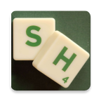
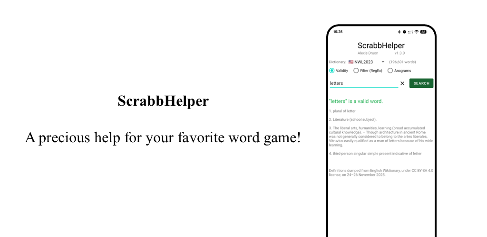
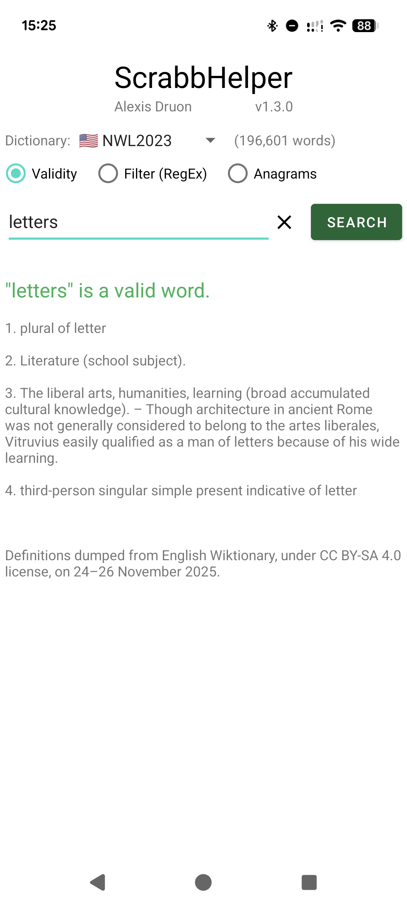
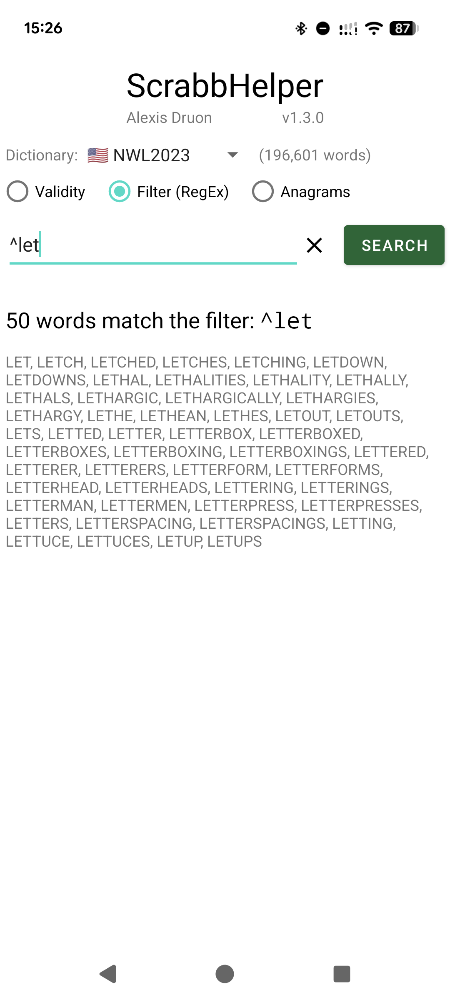
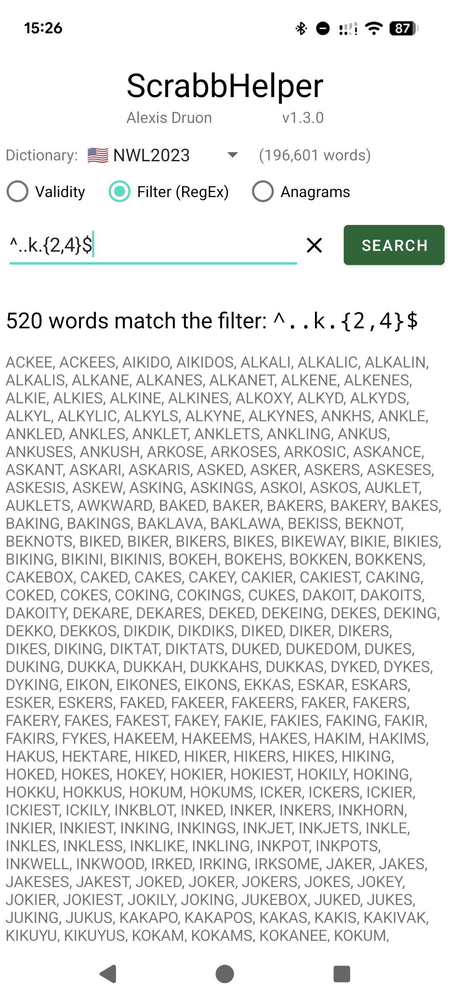
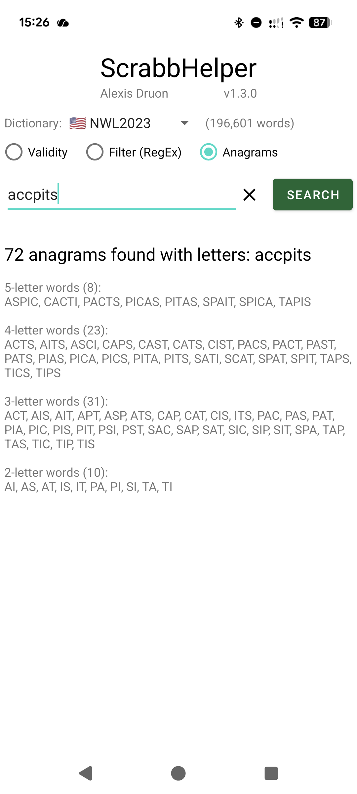

<table>
	<tr>
		<td rowspan="2"></td>
		<td>
			<h1>ScrabbHelper</h1>
			<b>A precious help for your favorite word game!</b>
		</td>
	</tr>
</table>

ScrabbHelper is much more than an official Scrabble® dictionary.

Beyond checking the spelling of your words, this application lets you:
- Verify if the word entered is playable
- Check definitions of 90%+ playable words*
- List all words matching a regular expression (e.g. "beginning with ...", "ending with ...", "containing ... (in ... place)")
- Search for anagrams

*Definitions are extracted from Wiktionary and may contain errors. Definitions are not available for 9.80% (27,534 words) of CSW24.

The application is available in:
- French (Officiel du jeu Scrabble (ODS9 and ODS8))
- English (Collins Scrabble Words (CSW24, CSW21/22 and CSW19) and NASPA Word List (NWL2023 and NWL2020))

<table>
	<tr>
		<td colspan="4"></td>
	</tr>
	<tr>
		<td></td>
		<td></td>
		<td></td>
		<td></td>
	</tr>
</table>